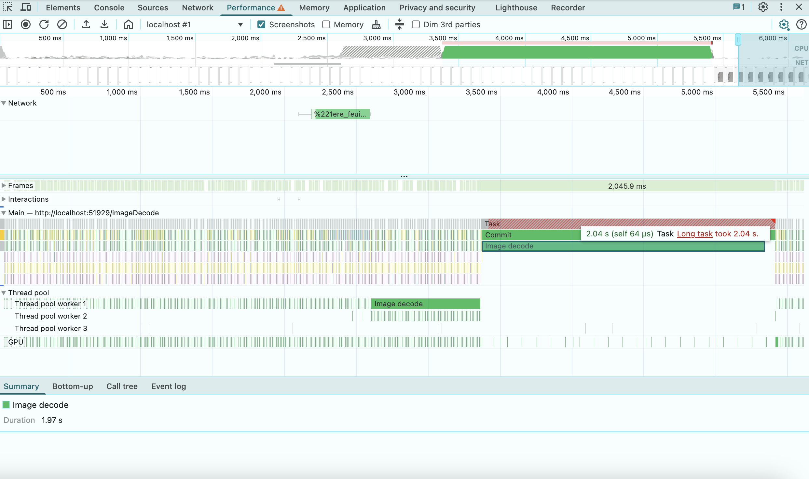

# fastDrawImage

There are problems with cross browser support of [drawImage](https://developer.mozilla.org/en-US/docs/Web/API/CanvasRenderingContext2D/drawImage) in different browsers. It works okay for small images, but with big images (~5mb and more) image decoding starts to block the main browser thread and leads to poor UX. Here is an example that shows 2 seconds of interruption in Chrome when we try `drawImage` without any optimizations


(Results from Chrome Profiler for Macbook M1, with 6x CPU throttling, ~7mb image data)
<br />
<br />

It is tricky to avoid image decoding on the main thread, because if something works good in one browser it fails in another (check folder [examples](./examples) for my experiments). I haven't looked much in bug trackers, but looks like there are these issues:
- Chrome always start decoding image event if it was explicitly decoded before with `.decode()` method
- Firefox always blocks the main thread after calling `.createImageBitmap()` with `Blob` as an argument. Surprisingly it blocks the main thread even if the `createImageBitmap()` is used inside a web worker.

To avoid image decoding on the main thread reliably in Firefox, Chrome and Safari, we need to use `.decode()` method for Firefox and Safari, and `createImageBitmap()` with `Blob` as an argument for Chrome:

```js
function isChromium() {
    return Boolean(window.chrome);
}

function fastDrawImage() {
    const imageUrl = './url_for_your_image.png';
    if (isChromium()) {
        fetch(imageUrl)
            .then(image => image.blob())
            .then(blob => createImageBitmap(blob))
            .then(bitmap => {
                const canvas = document.getElementById('canvas');
                const ctx = canvas.getContext('2d');
                ctx.drawImage(bitmap, 0, 0);
            });
    } else {
        const image = new Image();
        image.decoding = "async";
        image.onload = () => {
            image.decode().then(() => {
                const canvas = document.getElementById('canvas');
                const ctx = canvas.getContext('2d');
                ctx.drawImage(image, 0, 0);
            });
        };
        image.src = imageUrl;
    }
}
```

### License

The MIT License (MIT)

Copyright (c) 2025 Alexander Myshov

Permission is hereby granted, free of charge, to any person obtaining a copy of this software and associated documentation files (the "Software"), to deal in the Software without restriction, including without limitation the rights to use, copy, modify, merge, publish, distribute, sublicense, and/or sell copies of the Software, and to permit persons to whom the Software is furnished to do so, subject to the following conditions:

The above copyright notice and this permission notice shall be included in all copies or substantial portions of the Software.

THE SOFTWARE IS PROVIDED "AS IS", WITHOUT WARRANTY OF ANY KIND, EXPRESS OR IMPLIED, INCLUDING BUT NOT LIMITED TO THE WARRANTIES OF MERCHANTABILITY, FITNESS FOR A PARTICULAR PURPOSE AND NONINFRINGEMENT. IN NO EVENT SHALL THE AUTHORS OR COPYRIGHT HOLDERS BE LIABLE FOR ANY CLAIM, DAMAGES OR OTHER LIABILITY, WHETHER IN AN ACTION OF CONTRACT, TORT OR OTHERWISE, ARISING FROM, OUT OF OR IN CONNECTION WITH THE SOFTWARE OR THE USE OR OTHER DEALINGS IN THE SOFTWARE.
